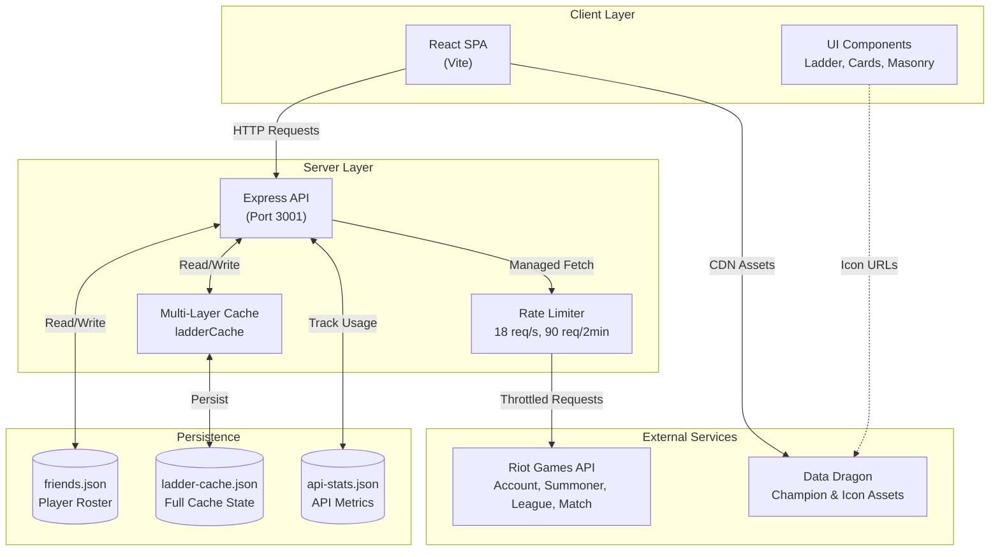
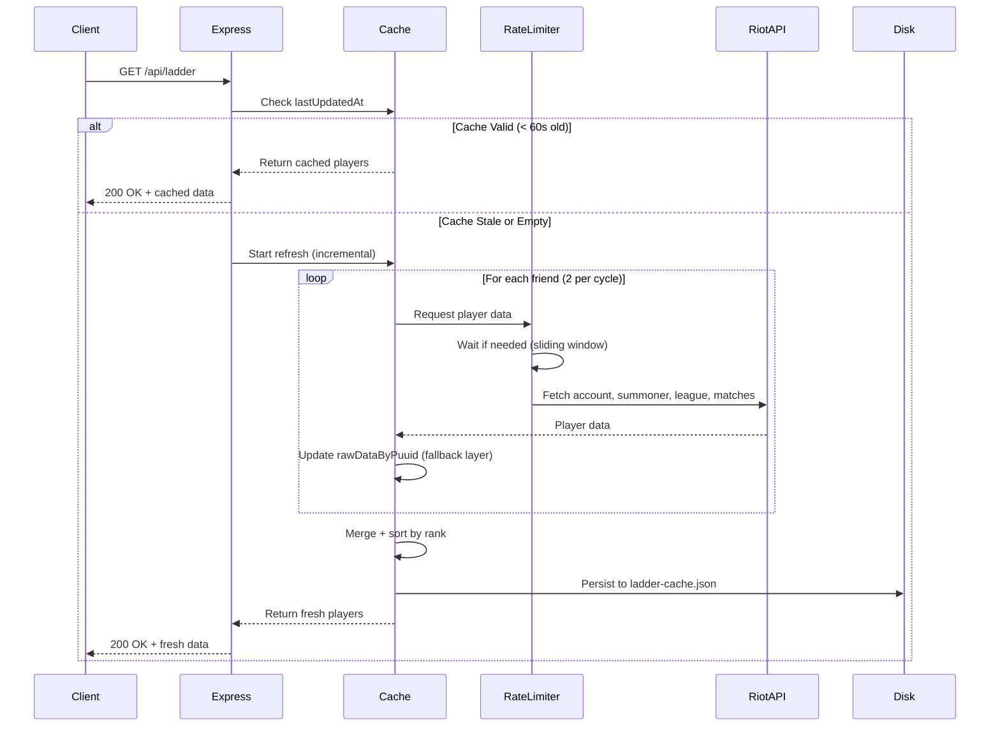

The Tullidos SoloQ Ladder is built as a full-stack JavaScript application with a clear separation between frontend and backend components, organized in a monorepo structure.

## Monorepo Structure

The project follows a standard monorepo layout:

```
workspace/
├── client/          # React frontend application
│   ├── src/
│   │   ├── App.jsx
│   │   ├── main.jsx
│   │   └── components/
│   └── dist/        # Production build output
├── server/          # Express backend API
│   ├── index.js     # Main server entry point
│   ├── friends.json # Player roster configuration
│   ├── ladder-cache.json  # Persistent cache
│   └── api-stats.json     # API usage statistics
└── package.json
```

## System Architecture Overview



## Component Breakdown

### Frontend (Client)

The client is a **React 18** single-page application built with Vite:

- **Main App** (`App.jsx`): 1100+ lines managing state, API calls, and rendering
- **Tabs**: Ranking, Hachitas (Top 10), Users (Masonry Wall), Info
- **Features**:
  - Real-time ladder updates (90-second polling)
  - Search and role filtering
  - Player cards with rank badges, champion icons, win rates
  - Activity signals and daily LP tracking
  - Duel tracker for specific player matchups

**Tech Stack**: React, Vite, React Masonry CSS

**API Communication**:
```javascript
const API_BASE = import.meta.env.VITE_API_URL || 
  (import.meta.env.DEV ? "http://localhost:3001" : window.location.origin);
```

### Backend (Server)

The server is an **Express.js** application (`server/index.js`, 1319 lines) that:

- Serves the React SPA (production mode)
- Provides REST API endpoints
- Manages rate-limited communication with Riot API
- Implements multi-layer caching strategy
- Tracks API usage statistics

**Key Configuration** (server/index.js:15-28):
```javascript
const PORT = process.env.PORT || 3001;
const RIOT_API_KEY = process.env.RIOT_API_KEY;
const REGION = "europe";        // Riot routing region
const PLATFORM = "euw1";        // EUW1 platform
const LADDER_CACHE_TTL_MS = 60_000;      // 1 minute
const MATCH_SYNC_TTL_MS = 1_800_000;     // 30 minutes
const FRIENDS_PER_REFRESH = 2;           // Incremental updates
```

## Data Flow

### Ladder Refresh Cycle



**Incremental Updates**: Instead of refreshing all players at once, the server uses a round-robin cursor to update `FRIENDS_PER_REFRESH` (default: 2) players per cycle. This spreads API load over time and keeps the ladder responsive.

### Riot API Integration

The server fetches data from multiple Riot API endpoints:

1. **Account-v1** (`europe` region): Resolve Riot ID → PUUID
   - `GET /riot/account/v1/accounts/by-riot-id/{gameName}/{tagLine}`
   - `GET /riot/account/v1/accounts/by-puuid/{puuid}`

2. **Summoner-v4** (`euw1` platform): Profile info
   - `GET /lol/summoner/v4/summoners/by-puuid/{puuid}`
   - Returns: `profileIconId`, `summonerLevel`

3. **League-v4** (`euw1` platform): Ranked stats
   - `GET /lol/league/v4/entries/by-puuid/{puuid}`
   - Returns: SoloQ and Flex rank, LP, wins, losses

4. **Match-v5** (`europe` region): Recent match history
   - `GET /lol/match/v5/matches/by-puuid/{puuid}/ids?queue=420&count=5`
   - `GET /lol/match/v5/matches/{matchId}`
   - Used to extract top 3 champions and main role

5. **Champion-Mastery-v4** (`euw1` platform): Fallback for champions
   - `GET /lol/champion-mastery/v4/champion-masteries/by-puuid/{puuid}/top?count=3`

### Cached Fetch with Fallback

Every Riot API call uses a **fetch-with-cache** pattern (server/index.js:671-726):

```javascript
async function fetchSummonerWithCache(puuid) {
  try {
    const summoner = await riotFetch(/* ... */);
    // Persist successful response
    const raw = ladderCache.rawDataByPuuid[puuid] || {};
    raw.summoner = { profileIconId: summoner.profileIconId, ... };
    raw.lastSummonerAt = new Date().toISOString();
    return summoner;
  } catch (err) {
    // Fall back to cached copy
    const cached = ladderCache.rawDataByPuuid[puuid]?.summoner;
    if (cached) {
      console.log(`[CACHE] summoner fallback for ${puuid.slice(0, 8)}…`);
      return cached;
    }
    throw err;
  }
}
```

This ensures **graceful degradation**: if a 429 rate limit error occurs mid-refresh, previously fetched data is preserved.

## API Endpoints

| Method | Endpoint | Description |
|--------|----------|-------------|
| `GET` | `/api/player?gameName=X&tagLine=Y` | Fetch single player by Riot ID |
| `GET` | `/api/ladder` | Get full ranked ladder with cache metadata |
| `GET` | `/api/friends` | List all tracked players from `friends.json` |
| `POST` | `/api/friends` | Add a new player to the roster |
| `DELETE` | `/api/friends/:gameName/:tagLine` | Remove a player |
| `GET` | `/api/status` | Rate limit status, cache metrics, daily highlights |
| `POST` | `/api/force-refresh` | Trigger full ladder refresh (all players) |

### Example Response: `/api/ladder`

```json
{
  "players": [
    {
      "riotId": "PlayerName#EUW",
      "puuid": "...",
      "profileIconId": 5231,
      "summonerLevel": 342,
      "soloq": {
        "tier": "DIAMOND",
        "rank": "II",
        "leaguePoints": 47,
        "wins": 123,
        "losses": 98
      },
      "flex": null,
      "topChampions": ["Jinx", "Caitlyn", "Ashe"],
      "mainRole": "BOTTOM"
    }
  ],
  "cachedAt": "2026-03-13T10:30:00.000Z",
  "cacheTtlMs": 60000,
  "stale": false,
  "ddragonVersion": "14.24.1"
}
```

## Static Assets

The client references static assets from Data Dragon CDN and local server paths:

- **Champion Icons**: `https://ddragon.leagueoflegends.com/cdn/{version}/img/champion/{name}.png`
- **Profile Icons**: `https://ddragon.leagueoflegends.com/cdn/{version}/img/profileicon/{id}.png`
- **Rank Badges**: `{API_BASE}/assets/icons/rank/{tier}.png` (served from `server/public/`)
- **Role Icons**: `{API_BASE}/assets/icons/position/{role}.png`

## Deployment Model

### Development Mode
- Client: Vite dev server on port 5173 (hot reload)
- Server: Node.js on port 3001
- Client proxies API requests to `http://localhost:3001`

### Production Mode
- Client: Built to `client/dist/` (`npm run build`)
- Server: Serves static files from `client/dist/` + API routes
- Single process on port 3001 (or `process.env.PORT`)
- SPA fallback for non-API routes (server/index.js:1261-1268)

**Production Detection** (server/index.js:20-22):
```javascript
const CLIENT_INDEX_FILE = path.join(CLIENT_DIST_DIR, "index.html");
const HAS_CLIENT_BUILD = fs.existsSync(CLIENT_INDEX_FILE);
```

If `client/dist/index.html` exists, the server automatically serves the built frontend.

## Key Design Principles

1. **Separation of Concerns**: Client handles UI/UX, server handles data fetching and rate limiting
2. **Progressive Enhancement**: Cached data allows the app to work even during rate limit cooldowns
3. **Incremental Updates**: Round-robin refresh reduces API pressure and keeps data relatively fresh
4. **Graceful Degradation**: Multi-layer cache ensures partial data is better than no data
5. **Single Deployment Unit**: Production build combines client + server into one deployable artifact

## Related Documentation

- [Rate Limiting](/development/rate-limiting) - Deep dive into proactive and reactive throttling
- [Caching Strategy](/development/caching-strategy) - Multi-layer cache architecture and persistence
