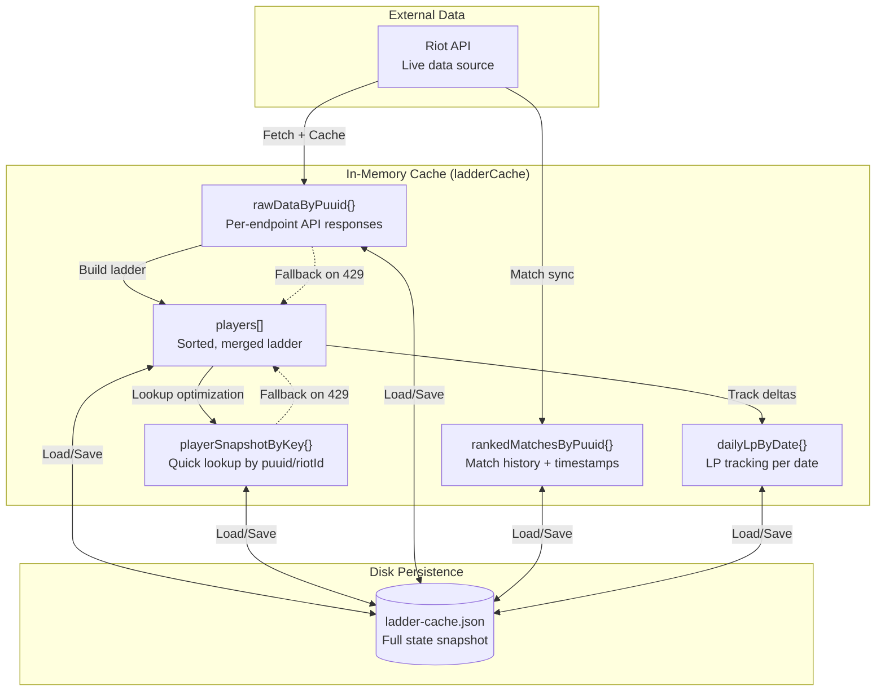
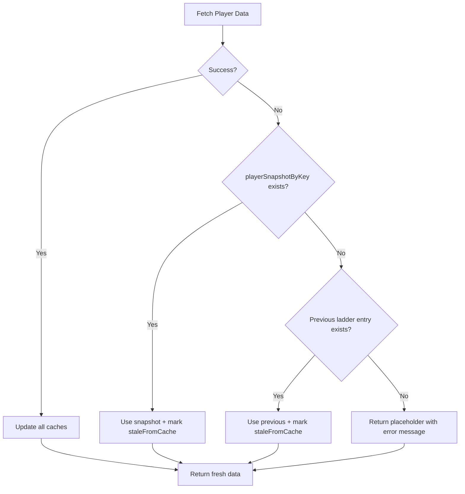

The Tullidos SoloQ Ladder uses a **multi-layer caching system** designed for resilience against rate limiting, partial data refresh, and fast cold-start performance. The cache persists to disk and provides granular fallback layers for every API endpoint.

## Cache Architecture Overview



## The ladderCache Object

All cache state lives in a single in-memory object (server/index.js:294-306):

```javascript
const ladderCache = {
  players: [],                    // Final merged ladder (sorted by rank)
  rankedMatchesByPuuid: {},       // { puuid: { matches: [], lastSyncAt } }
  playerSnapshotByKey: {},        // { "puuid:X" | "riot:Y": playerData }
  rawDataByPuuid: {},             // { puuid: { summoner, leagueEntries, account } }
  dailyLpByDate: {},              // { "2026-03-13": { "puuid:X": { soloqStartLp, ... } } }
  lpSnapshotByPlayer: {},         // Last-seen LP for delta calculation
  refreshCursor: 0,               // Round-robin index for incremental updates
  lastUpdatedAt: null,            // ISO timestamp of last successful refresh
  lastError: null,                // Last error message (if any)
  refreshPromise: null,           // Active refresh promise (prevents concurrent refreshes)
};
```

## Layer 1: players[] - The Presentation Layer

**Purpose**: Final, sorted, merged ladder for client consumption  
**Lifetime**: Refreshed every `LADDER_CACHE_TTL_MS` (default: 60 seconds)  
**Structure**:

```javascript
[
  {
    riotId: "PlayerName#EUW",
    puuid: "abc123...",
    profileIconId: 5231,
    summonerLevel: 342,
    soloq: { tier: "DIAMOND", rank: "II", leaguePoints: 47, wins: 123, losses: 98 },
    flex: null,
    topChampions: ["Jinx", "Caitlyn", "Ashe"],
    mainRole: "BOTTOM",
    emote: "🎯",
    staleFromCache: false  // true if loaded from fallback
  }
]
```

**Population**: Built by `buildLadderSnapshot()` (server/index.js:840-992)

**Sorting**: Ranked by `rankScore()` - `(tier * 10000) + (division * 100) + LP` (server/index.js:780-786)

## Layer 2: playerSnapshotByKey{} - Fast Lookup Layer

**Purpose**: O(1) lookup of last-known player data by PUUID or Riot ID  
**Keys**: `"puuid:{puuid}"` or `"riot:{gamename}#{tagline}"` (lowercase)  
**Use Case**: When a player's Riot ID changes, both old and new keys point to the same snapshot

**Example**:
```javascript
{
  "puuid:abc123...": { /* full player object */ },
  "riot:playername#euw": { /* same object reference */ }
}
```

**Update Logic** (server/index.js:917-920):
```javascript
const keys = buildFriendKeys(friend, snapshot);  // Generate all possible keys
for (const key of keys) {
  ladderCache.playerSnapshotByKey[key] = snapshot;
}
```

**Fallback Usage**: When a fetch fails, `getSnapshotFallback()` retrieves the last-known snapshot (server/index.js:661-665).

## Layer 3: rawDataByPuuid{} - Granular API Response Cache

**Purpose**: Persist individual API responses for partial fallback recovery  
**Structure**:

```javascript
{
  "abc123...": {
    account: { gameName: "Player", tagLine: "EUW", puuid: "abc123..." },
    lastAccountAt: "2026-03-13T10:15:00.000Z",
    
    summoner: { profileIconId: 5231, summonerLevel: 342 },
    lastSummonerAt: "2026-03-13T10:15:05.000Z",
    
    leagueEntries: [ /* soloq/flex entries */ ],
    lastLeagueAt: "2026-03-13T10:15:10.000Z"
  }
}
```

**Key Insight**: Each API endpoint is cached **independently**. If a match history fetch fails but summoner data succeeds, the cache retains both.

### Cached Fetch Pattern

Every Riot API call uses a fetch-with-cache wrapper (server/index.js:671-726):

```javascript
async function fetchSummonerWithCache(puuid) {
  try {
    // Attempt live fetch
    const summoner = await riotFetch(
      `https://${PLATFORM}.api.riotgames.com/lol/summoner/v4/summoners/by-puuid/${encodeURIComponent(puuid)}`
    );
    
    // Persist successful response
    const raw = ladderCache.rawDataByPuuid[puuid] || (ladderCache.rawDataByPuuid[puuid] = {});
    raw.summoner = { profileIconId: summoner.profileIconId, summonerLevel: summoner.summonerLevel };
    raw.lastSummonerAt = new Date().toISOString();
    return summoner;
  } catch (err) {
    // Fall back to cached copy
    const cached = ladderCache.rawDataByPuuid[puuid]?.summoner;
    if (cached) {
      console.log(`[CACHE] summoner fallback for ${puuid.slice(0, 8)}…`);
      return cached;
    }
    throw err;  // No fallback available
  }
}
```

**Similar wrappers exist for**:
- `fetchLeagueEntriesWithCache(puuid)` - Rank data
- `fetchAccountByPuuidWithCache(puuid)` - Riot ID resolution

### Why Granular Caching?

**Scenario**: Rate limit hits after fetching summoner data but before league entries.

- **Without granular cache**: Entire player fetch fails, no data updated
- **With granular cache**: Summoner data is preserved, only league entries fall back to stale cache

Result: **Partial updates are better than no updates**.

## Layer 4: rankedMatchesByPuuid{} - Match History Cache

**Purpose**: Store recent ranked matches for champion/role analysis  
**TTL**: `MATCH_SYNC_TTL_MS` (default: 30 minutes)  
**Structure**:

```javascript
{
  "abc123...": {
    matches: [
      {
        id: "EUW1_12345",
        championName: "Jinx",
        teamPosition: "BOTTOM",
        queueId: 420,  // SoloQ
        gameEndTimestamp: 1710328800000
      }
    ],
    lastSyncAt: "2026-03-13T10:00:00.000Z"
  }
}
```

### Smart Match Fetching

The `fetchRecentChampionsAndRole()` function (server/index.js:184-292) implements **incremental match sync**:

1. **Check cache freshness**: If `lastSyncAt` is within TTL, use cached matches
2. **Fetch match IDs**: Request 4-5 recent SoloQ + Flex match IDs
3. **Deduplicate**: Skip matches already in cache (by match ID)
4. **Fetch new matches**: Only download match details for unseen IDs
5. **Merge**: Combine new + cached matches, preserve newest 20
6. **Persist**: Update cache with merged list + timestamp

**Code Excerpt** (server/index.js:225-260):
```javascript
const existingById = new Map(existingMatches.map((m) => [m.id, m]));
const idsToFetch = incomingIds.filter((id) => !existingById.has(id)).slice(0, 4);

const fetchedMatches = [];
for (const id of idsToFetch) {
  try {
    const match = await riotFetch(`https://${REGION}.api.riotgames.com/lol/match/v5/matches/${id}`);
    const p = match.info.participants.find((pl) => pl.puuid === puuid);
    if (!p) continue;
    fetchedMatches.push({
      id,
      championName: p.championName || null,
      teamPosition: p.teamPosition || null,
      queueId: match.info.queueId || null,
      gameEndTimestamp: match.info.gameEndTimestamp || null,
    });
  } catch {
    // Ignore single-match errors to preserve partial progress
  }
}

// Merge: newest IDs first, then older cached matches
const merged = [];
for (const id of incomingIds) {
  const next = fetchedById.get(id) || existingById.get(id);
  if (next) merged.push(next);
}
for (const oldMatch of existingMatches) {
  if (!merged.some((m) => m.id === oldMatch.id)) merged.push(oldMatch);
}

ladderCache.rankedMatchesByPuuid[puuid] = {
  matches: merged.slice(0, 20),
  lastSyncAt: new Date().toISOString(),
};
```

**Why Incremental?**
- Reduces API calls (only fetch new matches)
- Tolerates partial failures (some matches can fail without losing progress)
- Preserves historical data (old matches remain until displaced by new ones)

### Champion Mastery Fallback

If match history is unavailable (new account, privacy settings), the system falls back to **Champion Mastery API** (server/index.js:142-159):

```javascript
async function fetchTopMasteryChampions(puuid) {
  try {
    const masteryRows = await riotFetch(
      `https://${PLATFORM}.api.riotgames.com/lol/champion-mastery/v4/champion-masteries/by-puuid/${encodeURIComponent(puuid)}/top?count=3`
    );
    const idNameMap = await getChampionIdNameMap();
    return masteryRows
      .map((row) => idNameMap.get(String(row?.championId)))
      .filter(Boolean)
      .slice(0, 3);
  } catch (err) {
    return [];  // Silent failure, no champions shown
  }
}
```

**Usage** (server/index.js:268-271):
```javascript
if (topChampions.length === 0) {
  topChampions = await fetchTopMasteryChampions(puuid);
}
```

## Layer 5: dailyLpByDate{} - LP Delta Tracking

**Purpose**: Track intraday LP changes for daily highlights  
**Lifetime**: Last 14 days retained (server/index.js:378-383)  
**Structure**:

```javascript
{
  "2026-03-13": {
    "puuid:abc123...": {
      puuid: "abc123...",
      riotId: "PlayerName#EUW",
      soloqStartLp: 50,      // LP at first observation today
      soloqCurrentLp: 68,    // Current LP
      soloqDeltaLp: 18,      // Net change today
      flexStartLp: null,
      flexCurrentLp: null,
      flexDeltaLp: 0,
      firstSeenAt: "2026-03-13T00:05:00.000Z",
      lastSeenAt: "2026-03-13T10:30:00.000Z"
    }
  }
}
```

### Delta Calculation Logic

The `updateDailyLpTracker()` function (server/index.js:314-384) runs after **every ladder refresh**:

1. **Initialize entry**: If player seen for first time today, set `soloqStartLp = currentLp`
2. **Detect changes**: Compare current LP to `lpSnapshotByPlayer` (last-seen value)
3. **Accumulate delta**: `soloqDeltaLp += (currentLp - previousLp)` if on same date
4. **Update snapshot**: Store new LP in `lpSnapshotByPlayer` for next comparison

**Key Insight**: Delta is **cumulative within the same day**, but resets at midnight.

**Code Excerpt** (server/index.js:351-359):
```javascript
if (Number.isFinite(soloLp)) {
  if (entry.soloqStartLp === null) entry.soloqStartLp = soloLp;
  const prevSolo = Number(playerSnapshot.soloqLp);
  if (Number.isFinite(prevSolo) && playerSnapshot.lastDateKey === todayKey) {
    entry.soloqDeltaLp = Number(entry.soloqDeltaLp || 0) + (soloLp - prevSolo);
  }
  entry.soloqCurrentLp = soloLp;
  playerSnapshot.soloqLp = soloLp;
}
```

### Daily Highlights

The `/api/status` endpoint uses `buildDailyHighlights()` (server/index.js:386-509) to generate:

- **bestSoloqGain**: Highest SoloQ LP gain today
- **bestFlexGain**: Highest Flex LP gain today
- **worstSoloqLoss**: Biggest SoloQ LP loss today
- **bestOverallGain**: Highest combined SoloQ + Flex gain
- **worstOverallLoss**: Biggest combined loss

**Fallback**: If no daily data exists (cache cold-start), defaults to current top-ranked player with 0 delta.

## Cache Persistence

### Save to Disk

The entire `ladderCache` is serialized to **ladder-cache.json** after every refresh (server/index.js:530-549):

```javascript
function saveCacheToFile() {
  try {
    fs.writeFileSync(
      CACHE_FILE,
      JSON.stringify({
        players: ladderCache.players,
        rankedMatchesByPuuid: ladderCache.rankedMatchesByPuuid,
        playerSnapshotByKey: ladderCache.playerSnapshotByKey,
        rawDataByPuuid: ladderCache.rawDataByPuuid,
        dailyLpByDate: ladderCache.dailyLpByDate,
        lpSnapshotByPlayer: ladderCache.lpSnapshotByPlayer,
        refreshCursor: ladderCache.refreshCursor,
        lastUpdatedAt: ladderCache.lastUpdatedAt,
        lastError: ladderCache.lastError,
      }, null, 2)
    );
  } catch (err) {
    console.warn("Could not save cache to file:", err.message);
  }
}
```

**Trigger Points**:
- After every successful ladder refresh (server/index.js:1028)
- After daily LP tracker update (server/index.js:1290)

### Load from Disk

On server startup, `loadCacheFromFile()` restores the in-memory cache (server/index.js:551-572):

```javascript
function loadCacheFromFile() {
  try {
    if (fs.existsSync(CACHE_FILE)) {
      const cached = JSON.parse(fs.readFileSync(CACHE_FILE, "utf8"));
      ladderCache.players = cached.players || [];
      ladderCache.rankedMatchesByPuuid = cached.rankedMatchesByPuuid || {};
      ladderCache.playerSnapshotByKey = cached.playerSnapshotByKey || {};
      ladderCache.rawDataByPuuid = cached.rawDataByPuuid || {};
      ladderCache.dailyLpByDate = cached.dailyLpByDate || {};
      ladderCache.lpSnapshotByPlayer = cached.lpSnapshotByPlayer || {};
      ladderCache.refreshCursor = Number(cached.refreshCursor) || 0;
      ladderCache.lastUpdatedAt = cached.lastUpdatedAt || null;
      ladderCache.lastError = cached.lastError || null;
      console.log(`Loaded ladder cache from file: ${ladderCache.players.length} players`);
      return true;
    }
  } catch (err) {
    console.warn("Could not load cache from file:", err.message);
  }
  return false;
}
```

**Cold-Start Behavior** (server/index.js:1284-1302):

1. **Cache exists**: Use cached data immediately, skip initial API refresh
2. **No cache**: Trigger full ladder refresh on startup

```javascript
const cacheLoadedFromDisk = loadCacheFromFile();
if (!cacheLoadedFromDisk) {
  console.log("No cache file found. Ladder will be empty until first refresh.");
} else {
  console.log("Using cached ladder snapshot from disk. Background refresh will run on schedule.");
}

if (RIOT_API_KEY) {
  if (!cacheLoadedFromDisk) {
    refreshLadderCache().catch((error) => {
      console.error("ERROR on first refresh:", error.message);
    });
  }
}
```

**Benefit**: App serves cached data instantly without waiting for Riot API calls.

## Incremental Refresh Strategy

Instead of refreshing **all** players at once, the server uses a **round-robin cursor** (server/index.js:994-1040):

```javascript
async function refreshLadderCache(forceFull = false) {
  const friends = readFriends();
  const previousPlayers = ladderCache.players;

  let friendIndexesToRefresh = null;
  if (!forceFull) {
    friendIndexesToRefresh = new Set();
    if (friends.length > 0) {
      const batchSize = Math.min(FRIENDS_PER_REFRESH, friends.length);
      const start = ladderCache.refreshCursor % friends.length;
      for (let i = 0; i < batchSize; i += 1) {
        friendIndexesToRefresh.add((start + i) % friends.length);
      }
      ladderCache.refreshCursor = (start + batchSize) % friends.length;
    }
  }

  const { players, nextFriends } = await buildLadderSnapshot(
    friends,
    previousPlayers,
    friendIndexesToRefresh
  );
  ladderCache.players = players;
  saveCacheToFile();
}
```

**How It Works**:

1. `refreshCursor` starts at 0
2. Refresh cycle updates players 0-1 (if `FRIENDS_PER_REFRESH = 2`)
3. Cursor advances to 2
4. Next cycle updates players 2-3
5. Repeats until cursor wraps to 0

**Skipped Players**: Use `playerSnapshotByKey` fallback (stale but valid data)

**Full Refresh**: `/api/force-refresh` endpoint bypasses cursor and updates all players immediately.

## Cache TTLs

| Cache Layer | TTL | Configured By |
|-------------|-----|---------------|
| `players[]` | 60s | `LADDER_CACHE_TTL_MS` |
| `rankedMatchesByPuuid` | 30m | `MATCH_SYNC_TTL_MS` |
| `rawDataByPuuid` | ∞ | Never expires (live fetch always attempted) |
| `playerSnapshotByKey` | ∞ | Updated on every successful fetch |
| `dailyLpByDate` | 14d | Pruned after 14 days |
| Disk cache | ∞ | Persists until deleted |

**Environment Variables**:
```bash
LADDER_CACHE_TTL_MS=60000       # 1 minute ladder refresh
MATCH_SYNC_TTL_MS=1800000       # 30 minutes match history
```

## Error Handling & Fallback Chain

When a fetch fails, the system tries **multiple fallback layers** (server/index.js:872-970):



**Code Excerpt** (server/index.js:926-938):
```javascript
if (result.status === "rejected") {
  const snapshotFallback = getSnapshotFallback(friend);
  if (snapshotFallback) {
    return {
      ...snapshotFallback,
      emote: friendEmote || snapshotFallback.emote || null,
      staleFromCache: true,
      error: null,
    };
  }

  const previous = getPreviousPlayerFallback(friend, previousByPuuid, previousByRiotId);
  if (previous) {
    return {
      ...previous,
      emote: friendEmote || previous.emote || null,
      staleFromCache: true,
      error: null,
    };
  }

  return {
    riotId: friend.gameName && friend.tagLine
      ? `${friend.gameName}#${friend.tagLine}`
      : (friend.puuid || "Unknown#TAG"),
    error: result.reason?.code === "RATE_LIMITED"
      ? "Riot en rate limit, reintentando con cache"
      : (result.reason?.message || "Error"),
    soloq: null,
  };
}
```

**Outcome**: Users always see **something** - even if it's stale data from hours ago.

## Cache Invalidation

### Manual Invalidation

1. **Delete cache file**: `rm server/ladder-cache.json` (forces cold-start on restart)
2. **Force refresh**: `POST /api/force-refresh` (updates all players immediately)

### Automatic Invalidation

None. The cache is **append-only** and **eventually consistent**. Old data is naturally displaced by fresh fetches over time.

## Performance Characteristics

| Operation | Time Complexity | Notes |
|-----------|----------------|-------|
| Lookup player by PUUID | O(1) | `playerSnapshotByKey` hash lookup |
| Lookup player by Riot ID | O(1) | `playerSnapshotByKey` hash lookup |
| Build ladder | O(n log n) | Sort by rank score |
| Persist cache to disk | O(n) | JSON serialization |
| Load cache from disk | O(n) | JSON parsing |

**Typical Cache Size**:
- 50 players × ~2 KB/player = **~100 KB** in-memory
- `ladder-cache.json` file: **~150 KB** (formatted JSON)

## Best Practices

1. **Always use cached fetch wrappers** (`fetchSummonerWithCache`, etc.) - never call `riotFetch` directly
2. **Persist after every update** - Call `saveCacheToFile()` after modifying cache
3. **Use incremental refresh** - Avoid `/api/force-refresh` in automated scripts
4. **Monitor `rawDataByPuuid` size** - Grows unbounded; consider pruning inactive PUUIDs
5. **Backup cache file** - Copy `ladder-cache.json` before major updates

## Common Issues

### Issue: Cache grows too large

**Cause**: `rawDataByPuuid` accumulates data for removed players  
**Solution**: Prune entries not in current `friends.json` during refresh

### Issue: Stale data persists for hours

**Cause**: Player at end of round-robin queue (updated every `friends.length / FRIENDS_PER_REFRESH` cycles)  
**Solution**: Increase `FRIENDS_PER_REFRESH` or decrease `LADDER_CACHE_TTL_MS`

### Issue: Daily highlights show wrong values

**Cause**: Server restarted mid-day, lost `lpSnapshotByPlayer` state  
**Solution**: Already handled - daily tracker seeds from cached `players` on startup (server/index.js:1288-1290)

## Related Documentation

- [System Architecture](/development/architecture) - How cache fits into overall design
- [Rate Limiting](/development/rate-limiting) - Why graceful fallbacks are critical
