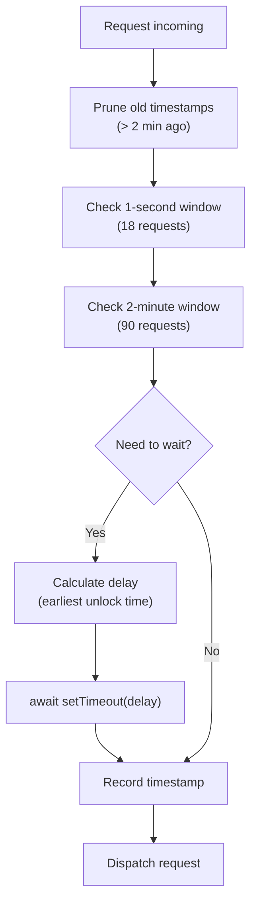
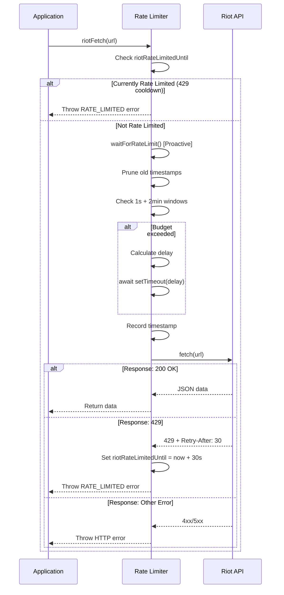

The Tullidos SoloQ Ladder implements a **two-tier rate limiting system** to ensure compliance with Riot API rate limits while maximizing throughput:

1. **Proactive Sliding Window** - Prevents exceeding budget before requests are sent
2. **Reactive 429 Handling** - Respects `Retry-After` headers when rate limits are hit

This hybrid approach ensures the application never loses data due to rate limit errors, while maintaining responsive user experience.

## Riot API Rate Limits

### Personal API Key Limits

Riot Games enforces hard limits on personal development keys:

- **20 requests per 1 second**
- **100 requests per 2 minutes**

Exceeding these limits results in **HTTP 429 (Too Many Requests)** responses with a `Retry-After` header indicating the cooldown period.

### Safety Margins

To account for request timing variance and concurrent operations, the application budgets **lower thresholds** (server/index.js:30-35):

```javascript
// Riot personal key hard limits: 20 req/1 s, 100 req/2 min.
// We budget to 18/1 s and 90/2 min for a safety margin.
const RATE_WINDOW_LIMITS = [
  { count: 18, windowMs: 1_000 },      // 18 requests per second
  { count: 90, windowMs: 120_000 },    // 90 requests per 2 minutes
];
```

This **10% buffer** provides headroom for:
- Network latency variations
- Clock skew between client and Riot servers
- Overlapping requests during refresh cycles

## Proactive Rate Limiting: Sliding Window

The **sliding window algorithm** tracks every outgoing request timestamp and delays new requests until both rate limit windows are satisfied.

### Request Timestamp Tracking

All dispatched requests are recorded in an ordered array (server/index.js:36-40):

```javascript
const requestTimestamps = []; // sorted epoch-ms of every dispatched Riot request
let totalRiotRequests = 0;     // lifetime total
let todayRiotRequests = 0;     // daily counter (resets at midnight)
let riotRateLimitedUntil = 0;  // reactive block timestamp
```

### Sliding Window Algorithm

Before **every** Riot API call, `waitForRateLimit()` calculates the minimum wait time needed (server/index.js:574-603):

```javascript
async function waitForRateLimit() {
  // 1. Prune timestamps older than the widest window (2 minutes)
  const horizon = Date.now() - 120_000;
  while (requestTimestamps.length > 0 && requestTimestamps[0] < horizon) {
    requestTimestamps.shift();
  }

  // 2. Calculate earliest moment when all windows are satisfied
  let waitUntil = Date.now();
  for (const { count, windowMs } of RATE_WINDOW_LIMITS) {
    if (requestTimestamps.length >= count) {
      // The oldest timestamp that would still be inside the window after this call
      const blockingTs = requestTimestamps[requestTimestamps.length - count];
      const unlockAt = blockingTs + windowMs + 60; // +60 ms safety buffer
      if (unlockAt > waitUntil) waitUntil = unlockAt;
    }
  }

  // 3. Wait if necessary
  const delay = waitUntil - Date.now();
  if (delay > 0) {
    console.log(
      `[RATE] Throttling ${delay} ms — window: ${requestTimestamps.length} req in last 2 min`
    );
    await new Promise((r) => setTimeout(r, delay));
  }

  // 4. Record this request
  requestTimestamps.push(Date.now());
  totalRiotRequests += 1;
  todayRiotRequests += 1;
  saveApiStatsToFile(false);
}
```

### How It Works



**Example Scenario**:

1. App has sent **18 requests** in the last 950ms
2. New request arrives
3. Sliding window detects: `requestTimestamps.length (18) >= count (18)`
4. Finds blocking timestamp: `requestTimestamps[0]` (oldest in window)
5. Calculates unlock: `blockingTs + 1000ms + 60ms = earliest safe time`
6. Waits until that timestamp before dispatching

### Advantages

- **Zero 429 errors** under normal operation (budget never exceeded)
- **Predictable throughput**: Requests are throttled smoothly rather than bursting
- **Multi-window enforcement**: Both 1-second and 2-minute limits are respected simultaneously

## Reactive Rate Limiting: 429 Handling

Even with proactive throttling, 429 errors can occur due to:
- Shared rate limits (if multiple apps use the same API key)
- External factors (Riot server-side adjustments)
- Clock drift or race conditions

### Hard Block on 429

When a 429 is received, `riotRateLimitedUntil` is set to block **all** requests until the cooldown expires (server/index.js:605-643):

```javascript
async function riotFetch(baseUrl) {
  // Reactive: hard block when a 429 was received
  if (Date.now() < riotRateLimitedUntil) {
    const waitSeconds = Math.ceil((riotRateLimitedUntil - Date.now()) / 1000);
    const err = new Error(`Rate limit activo, reintentando en ${waitSeconds}s`);
    err.code = "RATE_LIMITED";
    throw err;
  }

  // Proactive: sliding-window throttle
  await waitForRateLimit();

  const response = await fetch(baseUrl, {
    method: "GET",
    headers: {
      Accept: "application/json",
      "X-Riot-Token": RIOT_API_KEY,
    },
  });
  const text = await response.text();

  // Handle 429
  if (response.status === 429) {
    const retryAfterHeader = response.headers.get("retry-after");
    const retryAfterSeconds = Number(retryAfterHeader);
    const retryMs = Number.isFinite(retryAfterSeconds) && retryAfterSeconds > 0
      ? retryAfterSeconds * 1000
      : RATE_LIMIT_FALLBACK_MS; // default: 60 seconds
    riotRateLimitedUntil = Date.now() + retryMs;

    const err = new Error("Riot API rate limit exceeded");
    err.code = "RATE_LIMITED";
    err.retryAfterMs = retryMs;
    throw err;
  }

  if (!response.ok) {
    throw new Error(`Riot API ${response.status}: ${text || response.statusText}`);
  }
  return text ? JSON.parse(text) : null;
}
```

### Retry-After Header Parsing

Riot's `Retry-After` header specifies the cooldown period in **seconds**. The server:

1. Parses the header: `const retryAfterSeconds = Number(response.headers.get("retry-after"))`
2. Converts to milliseconds: `retryAfterSeconds * 1000`
3. Falls back to 60 seconds if header is missing/invalid
4. Blocks all requests until `Date.now() >= riotRateLimitedUntil`

### Fallback Configuration

```javascript
const RATE_LIMIT_FALLBACK_MS = Number(process.env.RATE_LIMIT_FALLBACK_MS) || 60 * 1000;
```

**Environment Variable**: `RATE_LIMIT_FALLBACK_MS`  
**Default**: 60000 (1 minute)  
**Purpose**: Safety net when `Retry-After` header is missing

## Request Flow Diagram



## API Usage Statistics

The server tracks API usage for monitoring and debugging (server/index.js:49-100):

### Persistent Metrics (api-stats.json)

```json
{
  "totalRiotRequests": 4523,
  "perDay": {
    "2026-03-12": 1203,
    "2026-03-13": 847
  },
  "updatedAt": "2026-03-13T10:30:00.000Z"
}
```

- **totalRiotRequests**: Lifetime counter (never resets)
- **perDay**: Daily breakdown (last 31 days retained)
- **Auto-save**: Writes to disk every 5 seconds (debounced)

### Status Endpoint

The `/api/status` endpoint exposes real-time metrics (server/index.js:1206-1244):

```json
{
  "riotRateLimited": false,
  "riotRateLimitedUntil": 0,
  "rateLimitSecondsLeft": 0,
  "recentRequests1s": 3,
  "recentRequests2min": 42,
  "budgetRemaining1s": 15,
  "budgetRemaining2min": 48,
  "totalRequests": 4523,
  "todayRequests": 847
}
```

**Client Polling**: The React frontend polls `/api/status` every 15 seconds to display real-time API usage in the UI (App.jsx:532-564).

## Throttling in Action

### Low-Volume Scenario (< 18 req/s)

```
[10:00:00.000] Request 1 dispatched
[10:00:00.050] Request 2 dispatched (no delay)
[10:00:00.100] Request 3 dispatched (no delay)
...
[10:00:00.850] Request 18 dispatched (no delay)
[10:00:00.900] Request 19 blocked
[RATE] Throttling 160 ms — window: 18 req in last 2 min
[10:00:01.060] Request 19 dispatched (after delay)
```

### High-Volume Scenario (burst protection)

```
[10:00:00.000] Requests 1-18 dispatched rapidly
[10:00:01.060] Requests 19-36 dispatched (1s window reset)
[10:00:02.120] Requests 37-54 dispatched
...
[10:01:05.000] Request 91 blocked (2-minute window full)
[RATE] Throttling 55000 ms — window: 90 req in last 2 min
[10:02:00.060] Request 91 dispatched (after 2min window clears)
```

## Configuration Options

All rate limiting behavior can be tuned via environment variables:

| Variable | Default | Description |
|----------|---------|-------------|
| `RATE_LIMIT_FALLBACK_MS` | 60000 | Cooldown when 429 has no `Retry-After` |
| `FRIENDS_PER_REFRESH` | 2 | Players updated per cycle (affects burst size) |
| `LADDER_CACHE_TTL_MS` | 60000 | Refresh interval (affects request frequency) |

**Example** (server/.env):
```bash
RATE_LIMIT_FALLBACK_MS=90000  # 90-second fallback
FRIENDS_PER_REFRESH=3         # Update 3 players per minute
LADDER_CACHE_TTL_MS=120000    # Refresh every 2 minutes
```

## Best Practices

1. **Never skip proactive throttling** - Always call `waitForRateLimit()` before `fetch()`
2. **Respect 429 blocks** - Do not retry during `riotRateLimitedUntil` cooldown
3. **Use cached fallbacks** - See [Caching Strategy](/development/caching-strategy) for handling errors gracefully
4. **Monitor daily usage** - Track `todayRequests` to stay within production key quotas
5. **Test with small batches** - Use `FRIENDS_PER_REFRESH=1` during development

## Common Issues

### Issue: 429 errors despite proactive throttling

**Cause**: Shared API key usage (multiple apps) or server clock drift  
**Solution**: Reactive handler automatically blocks and retries after cooldown

### Issue: Ladder updates are too slow

**Cause**: Conservative `FRIENDS_PER_REFRESH` setting  
**Solution**: Increase to 3-4 (but monitor `recentRequests2min` to stay under 90)

### Issue: App freezes after 429

**Cause**: Missing error handling in calling code  
**Solution**: All fetch wrappers (`fetchSummonerWithCache`, etc.) already catch and fall back to cache

## Related Documentation

- [System Architecture](/development/architecture) - How rate limiter fits into overall design
- [Caching Strategy](/development/caching-strategy) - Handling rate limit errors with cached fallbacks
