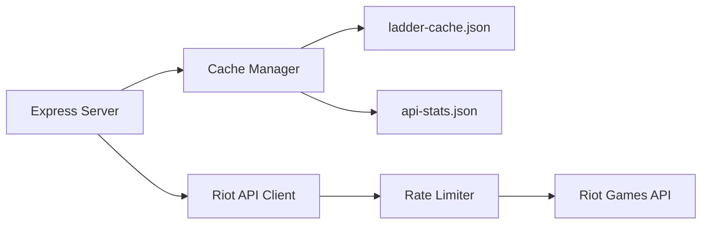
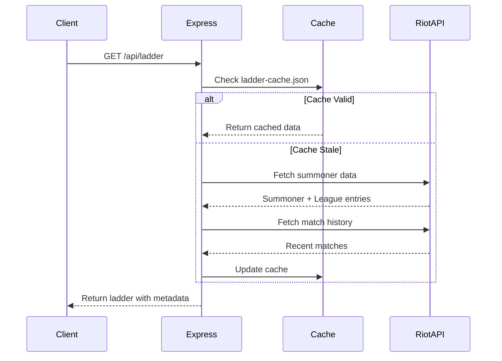

## What is Tullidos SoloQ Ladder?

Tullidos SoloQ Ladder is a **full-stack web application** that tracks and visualizes League of Legends ranked statistics for your friend group. It provides real-time insights into SoloQ and Flex rankings, daily LP changes, and activity trends.

<Note>
Built for small friend groups who want to track their League of Legends progress together and see who's climbing the ladder fastest.
</Note>

## Key Features

<CardGroup cols={2}>
  <Card title="Real-Time Ranking" icon="trophy">
    Track friends' SoloQ and Flex rankings with live LP updates from the Riot Games API
  </Card>
  
  <Card title="Daily Highlights" icon="chart-line">
    See who gained or lost the most LP today with automatic daily tracking and highlights
  </Card>
  
  <Card title="Smart Caching" icon="database">
    Intelligent cache system respects Riot API rate limits while keeping data fresh
  </Card>
  
  <Card title="Player Insights" icon="magnifying-glass-chart">
    View top champions, main roles, win rates, and activity signals for each player
  </Card>
</CardGroup>

## Architecture Overview

Tullidos SoloQ Ladder is built with a clean separation between frontend and backend:

### Backend (Express + Node.js)



The backend handles:
- **API Integration**: Fetches summoner, league, and match data from Riot API
- **Rate Limiting**: Proactive sliding-window rate limiter (18 req/1s, 90 req/2min)
- **Caching**: Persistent file-based cache with TTL-based refresh
- **Daily Tracking**: Monitors LP changes throughout the day

### Frontend (React + Vite)

The client provides:
- **Ladder View**: Sortable, filterable ranking table with search
- **Activity Feed**: Real-time signals about player activity and performance
- **Duel System**: Head-to-head LP comparison for rivalries
- **User Wall**: Masonry grid showcasing all tracked players

## Technology Stack

<Tabs>
  <Tab title="Backend">
    - **Runtime**: Node.js 20+
    - **Framework**: Express 5.x
    - **Key Dependencies**:
      - `cors` - Cross-origin resource sharing
      - `dotenv` - Environment configuration
    - **API**: Riot Games API (RGAPI)
  </Tab>
  
  <Tab title="Frontend">
    - **Framework**: React 19
    - **Build Tool**: Vite 7
    - **Animation Libraries**:
      - `motion` - Declarative animations
      - `gsap` - Advanced timeline animations
    - **UI Components**:
      - `react-masonry-css` - Responsive grid layouts
  </Tab>
</Tabs>

## Use Cases

### Friend Group Ladder
Create a private leaderboard for your Discord server or friend group to see who's truly the best.

```json
// server/friends.json
[
  {
    "gameName": "Azpy",
    "tagLine": "1337",
    "puuid": "_89HyfW-MAxI2WUUvggoF6WhSrbLCYXnHjgKKkax5jzR...",
    "mote": "Azpy"
  },
  {
    "gameName": "Hachitas",
    "tagLine": "Norge",
    "puuid": "oDmahfL32t1YKUyrZ9WKBlF3fQBPtNn1AqB3qjRKbiK..."
  }
]
```

### LP Betting & Challenges
Set up LP-based challenges between players. The built-in "Duel" feature displays head-to-head comparisons.

### Progress Tracking
Monitor daily LP gains/losses with persistent tracking across sessions:

<CodeGroup>
```javascript Daily LP Tracking
// server/index.js:314-384
function updateDailyLpTracker(players) {
  const todayKey = getDateKey();
  const dailyMap = ladderCache.dailyLpByDate[todayKey] || 
    (ladderCache.dailyLpByDate[todayKey] = {});
  
  for (const player of players || []) {
    if (!player || player.error) continue;
    
    const soloLp = Number(player?.soloq?.leaguePoints);
    const flexLp = Number(player?.flex?.leaguePoints);
    
    // Track delta from first seen LP today
    entry.soloqDeltaLp = soloLp - entry.soloqStartLp;
  }
}
```

```javascript Daily Highlights
// server/index.js:386-509
function buildDailyHighlights() {
  const todayKey = getDateKey();
  const dailyMap = ladderCache.dailyLpByDate[todayKey] || {};
  
  let bestSoloqGain = null;
  let worstSoloqLoss = null;
  
  for (const row of entries) {
    const delta = row.soloqCurrentLp - row.soloqStartLp;
    if (!bestSoloqGain || delta > bestSoloqGain.deltaLp) {
      bestSoloqGain = { player: row.riotId, deltaLp: delta };
    }
  }
  
  return { bestSoloqGain, worstSoloqLoss, ... };
}
```
</CodeGroup>

## Rate Limiting & Caching

<Warning>
The Riot API has strict rate limits for personal API keys: **20 requests/second** and **100 requests/2 minutes**. Tullidos implements a conservative budget of **18 req/1s** and **90 req/2min** to avoid 429 errors.
</Warning>

The app implements a **proactive sliding-window rate limiter**:

```javascript
// server/index.js:576-603
async function waitForRateLimit() {
  // Prune timestamps older than the widest window (2 min)
  const horizon = Date.now() - 120_000;
  while (requestTimestamps.length > 0 && requestTimestamps[0] < horizon) 
    requestTimestamps.shift();

  let waitUntil = Date.now();
  for (const { count, windowMs } of RATE_WINDOW_LIMITS) {
    if (requestTimestamps.length >= count) {
      const blockingTs = requestTimestamps[requestTimestamps.length - count];
      const unlockAt = blockingTs + windowMs + 60; // +60ms safety buffer
      if (unlockAt > waitUntil) waitUntil = unlockAt;
    }
  }

  const delay = waitUntil - Date.now();
  if (delay > 0) await new Promise((r) => setTimeout(r, delay));
}
```

### Incremental Refresh Strategy

Instead of refreshing all players every cycle, the app uses **batch refresh**:

```javascript
// server/index.js:1004-1016
if (!forceFull) {
  friendIndexesToRefresh = new Set();
  if (friends.length > 0) {
    const batchSize = Math.min(FRIENDS_PER_REFRESH, friends.length);
    const start = ladderCache.refreshCursor % friends.length;
    for (let i = 0; i < batchSize; i += 1) {
      friendIndexesToRefresh.add((start + i) % friends.length);
    }
    ladderCache.refreshCursor = (start + batchSize) % friends.length;
  }
}
```

<Note>
By default, only **2 friends per refresh cycle** are updated. This spreads API calls over time and ensures fresh data without hitting rate limits.
</Note>

## Data Flow



## Next Steps

<CardGroup cols={2}>
  <Card title="Quickstart" icon="rocket" href="/quickstart">
    Get the app running locally in under 5 minutes
  </Card>
  
  <Card title="Installation" icon="download" href="/installation">
    Detailed setup guide with all configuration options
  </Card>
</CardGroup>
